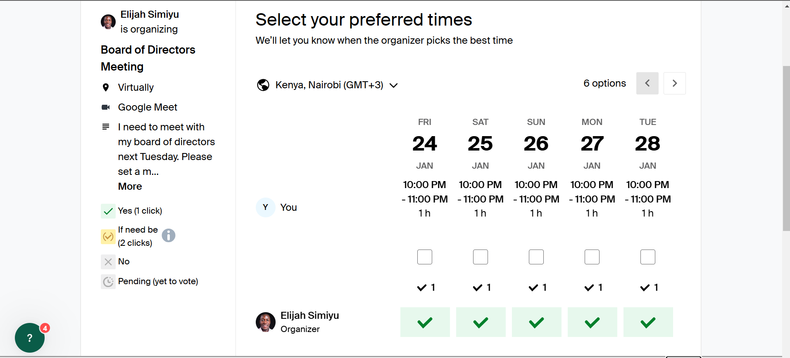
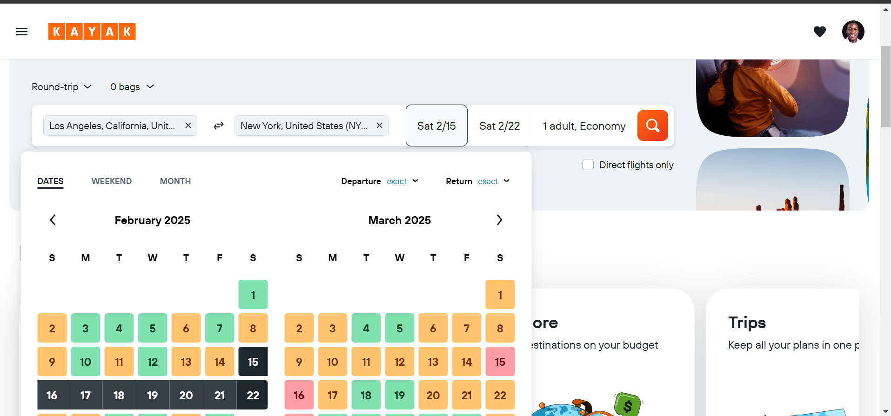

# Hello, I'm Elijah 👋

## About Me
I'm an organized and tech-savvy professional with a strong background in **Banking and Finance**, complemented by hands-on experience as a **Virtual Assistant** and **Sales Representative**. 

I bring expertise in:
- Managing administrative tasks
- Data entry and customer interactions
- Creating and tracking invoices
- Organizing company data, coordinating schedules, and preparing detailed reports

Proficient in **MS Office** and **CRM systems**, I excel in managing tasks remotely and thrive in dynamic, fast-paced environments. I am well-suited to support **C-level executives** in streamlining operations and ensuring efficient communication.

---

## Objective
To leverage my expertise in administrative management, customer interaction, and data organization, along with proficiency in MS Office and CRM systems, to provide exceptional virtual assistance. My goal is to streamline operations, enhance communication, and support C-level executives in achieving organizational efficiency and success.

---

## Skills
| **Skill**                  | **Associated Project**                                   |
|----------------------------|---------------------------------------------------------|
| Administrative Management  | [Efficient Scheduling System](#)                        |
| Data Organization          | [Company Data Analysis](#)                              |
| CRM System Proficiency      | [Client Relationship Enhancement](#)                   |
| Invoicing and Reporting     | [Financial Tracking and Reporting](#)                  |

---

## Projects

## Let's Connect!

- 💼 [LinkedIn](https://www.linkedin.com/in/elijah-simiyu) *(Connect with me on LinkedIn)*
- 📧 [Email Me](mailto:esimiyu368@gmail.com) *(Email me)*
- 📸 [Instagram](https://www.instagram.com/_yung_eli?igsh=Mm0ydHp3ZzgzcGE=) *@_yung_eli*
- 🌐 [Facebook](https://www.facebook.com/elijah.hart.9847?mibextid=ZbWKwL) *(Elijah Hart)*
- 🐦 [X (Twitter)](https://x.com/elijahsimiyu17?t=K7vFs5bKigjp-1LHib4vEg&s=09) *(Follow me on Twitter)*
